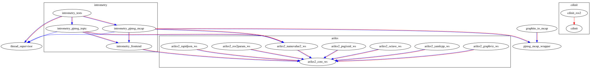

Overview
========

<table>
  <tr>
    <td align="center">
        CI status
    </td>
    <td align="center">
        Debian package
    </td>
  </tr>
  <tr>
    <td align="center">
        <a href="https://github.com/asherikov/sharf/actions/workflows/main.yaml">
        
        </a>
    </td>
    <td align="center">
        <a href="https://cloudsmith.io/~asherikov-aV7/repos/all/packages/detail/deb/sharf--reldebug--all/latest/a=amd64;d=ubuntu%252Fjammy;t=binary/">
        
        </a>
        <br />
        <a href="https://cloudsmith.io/~asherikov-aV7/repos/all/packages/detail/deb/sharf--reldebug--all/latest/a=amd64;d=ubuntu%252Fnoble;t=binary/">
        
        </a>
    </td>
  </tr>
</table>

A collection of utility packages for ROS/robotics projects. Refer to
<http://www.sherikov.net/sharf/> for more information.

Packages
========

Dependency graph
----------------

[](pkg_dependency_graph.svg)

Doxygen documentation
---------------------

| **Package** | Dependencies | Dependents |
| ----------- | :----------: | :--------: |
| [ariles2_core_ws](./ariles2_core_ws/index.html) | [graph](./ariles2_core_ws/pkg_dependency_graph.svg) | [graph](./ariles2_core_ws/pkg_reverse_dependency_graph.svg) |
| [ariles2_graphviz_ws](./ariles2_graphviz_ws/index.html) | [graph](./ariles2_graphviz_ws/pkg_dependency_graph.svg) | [graph](./ariles2_graphviz_ws/pkg_reverse_dependency_graph.svg) |
| [ariles2_namevalue2_ws](./ariles2_namevalue2_ws/index.html) | [graph](./ariles2_namevalue2_ws/pkg_dependency_graph.svg) | [graph](./ariles2_namevalue2_ws/pkg_reverse_dependency_graph.svg) |
| [ariles2_octave_ws](./ariles2_octave_ws/index.html) | [graph](./ariles2_octave_ws/pkg_dependency_graph.svg) | [graph](./ariles2_octave_ws/pkg_reverse_dependency_graph.svg) |
| [ariles2_pugixml_ws](./ariles2_pugixml_ws/index.html) | [graph](./ariles2_pugixml_ws/pkg_dependency_graph.svg) | [graph](./ariles2_pugixml_ws/pkg_reverse_dependency_graph.svg) |
| [ariles2_rapidjson_ws](./ariles2_rapidjson_ws/index.html) | [graph](./ariles2_rapidjson_ws/pkg_dependency_graph.svg) | [graph](./ariles2_rapidjson_ws/pkg_reverse_dependency_graph.svg) |
| [ariles2_ros2param_ws](./ariles2_ros2param_ws/index.html) | [graph](./ariles2_ros2param_ws/pkg_dependency_graph.svg) | [graph](./ariles2_ros2param_ws/pkg_reverse_dependency_graph.svg) |
| [ariles2_yamlcpp_ws](./ariles2_yamlcpp_ws/index.html) | [graph](./ariles2_yamlcpp_ws/pkg_dependency_graph.svg) | [graph](./ariles2_yamlcpp_ws/pkg_reverse_dependency_graph.svg) |
| [cdinit](./cdinit/index.html) | [graph](./cdinit/pkg_dependency_graph.svg) | [graph](./cdinit/pkg_reverse_dependency_graph.svg) |
| [cdinit_examples](./cdinit_examples/index.html) | [graph](./cdinit_examples/pkg_dependency_graph.svg) | [graph](./cdinit_examples/pkg_reverse_dependency_graph.svg) |
| [cdinit_manager](./cdinit_manager/index.html) | [graph](./cdinit_manager/pkg_dependency_graph.svg) | [graph](./cdinit_manager/pkg_reverse_dependency_graph.svg) |
| [graphite_to_mcap](./graphite_to_mcap/index.html) | [graph](./graphite_to_mcap/pkg_dependency_graph.svg) | [graph](./graphite_to_mcap/pkg_reverse_dependency_graph.svg) |
| [intrometry_frontend](./intrometry_frontend/index.html) | [graph](./intrometry_frontend/pkg_dependency_graph.svg) | [graph](./intrometry_frontend/pkg_reverse_dependency_graph.svg) |
| [intrometry_pjmsg_mcap](./intrometry_pjmsg_mcap/index.html) | [graph](./intrometry_pjmsg_mcap/pkg_dependency_graph.svg) | [graph](./intrometry_pjmsg_mcap/pkg_reverse_dependency_graph.svg) |
| [intrometry_pjmsg_topic](./intrometry_pjmsg_topic/index.html) | [graph](./intrometry_pjmsg_topic/pkg_dependency_graph.svg) | [graph](./intrometry_pjmsg_topic/pkg_reverse_dependency_graph.svg) |
| [intrometry_tests](./intrometry_tests/index.html) | [graph](./intrometry_tests/pkg_dependency_graph.svg) | [graph](./intrometry_tests/pkg_reverse_dependency_graph.svg) |
| [pjmsg_mcap_wrapper](./pjmsg_mcap_wrapper/index.html) | [graph](./pjmsg_mcap_wrapper/pkg_dependency_graph.svg) | [graph](./pjmsg_mcap_wrapper/pkg_reverse_dependency_graph.svg) |
| [thread_supervisor](./thread_supervisor/index.html) | [graph](./thread_supervisor/pkg_dependency_graph.svg) | [graph](./thread_supervisor/pkg_reverse_dependency_graph.svg) |

Total number of packages: 
18

Workspace status
-----
:::{.wide}
```
tags/0.2.2-0-g9652f6a
WSH: >>> status: git sources ---
Flags: H - version hash mismatch, M - uncommited changes
name               version  actual version           HM repository
----               -------  --------------           -- ----------
ariles             pkg_ws_2 tags/ws-2.5.2-0-ge2c1a11    https://github.com/asherikov/ariles.git
cdinit             master   heads/master-0-gf2f6f0a     https://github.com/asherikov/cdinit.git
graphite_to_mcap   main     heads/main-0-g01d3768       https://github.com/asherikov/graphite_to_mcap.git
intrometry         main     heads/main-0-gb53b80d       https://github.com/asherikov/intrometry.git
pjmsg_mcap_wrapper main     heads/main-0-gc89d9cd       https://github.com/asherikov/pjmsg_mcap_wrapper.git
thread_supervisor  master   tags/1.2.3-0-g2d740f6       https://github.com/asherikov/thread_supervisor.git

WSH:  <<< status: git sources ---
```
:::


Useful links
============

- [ROS online status](https://status.openrobotics.org/)
- [ROSDEP packages](https://github.com/ros/rosdistro/blob/master/rosdep/base.yaml)

ROS1
----
- [C++ API](http://docs.ros.org/en/noetic/api/roscpp/html/)
- [catkin API](https://docs.ros.org/en/noetic/api/catkin/html/dev_guide/generated_cmake_api.html)

ROS2
----
- [C++ API](https://docs.ros2.org/latest/api/rclcpp/namespacerclcpp.html)
- [ament](https://docs.ros.org/en/foxy/How-To-Guides/Ament-CMake-Documentation.html)
